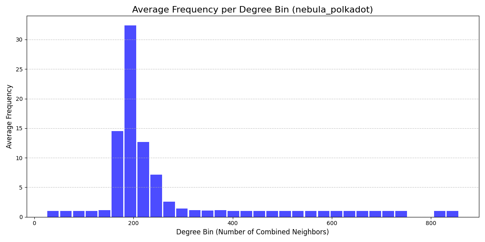
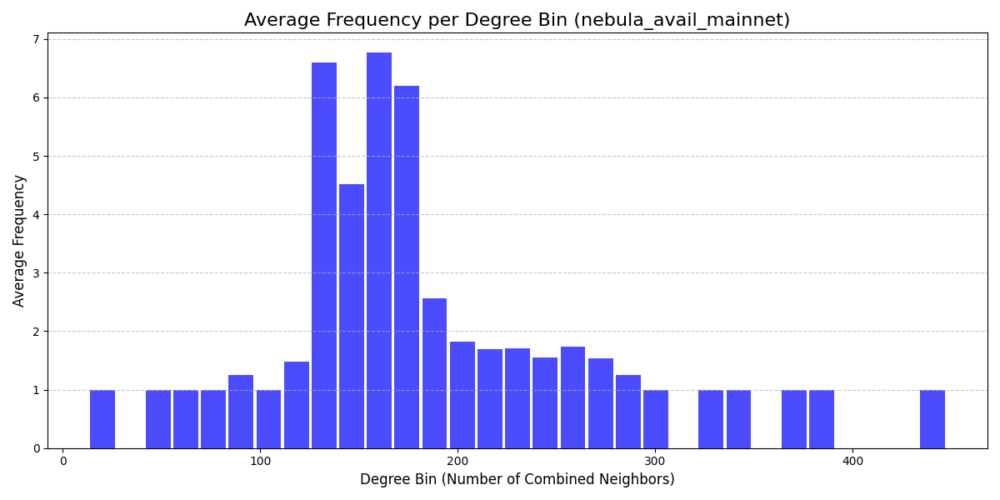
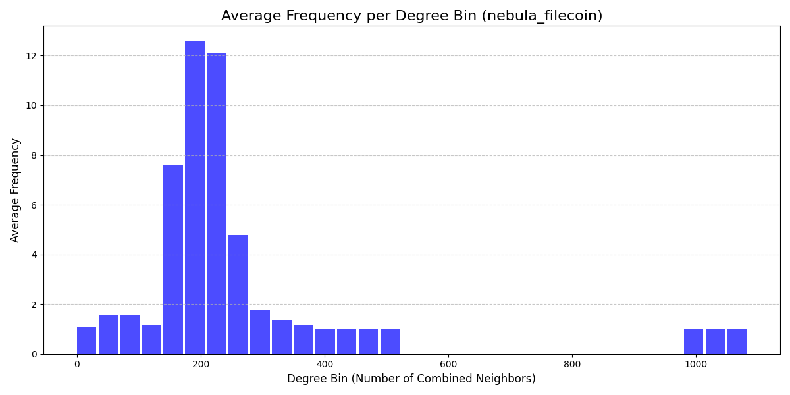
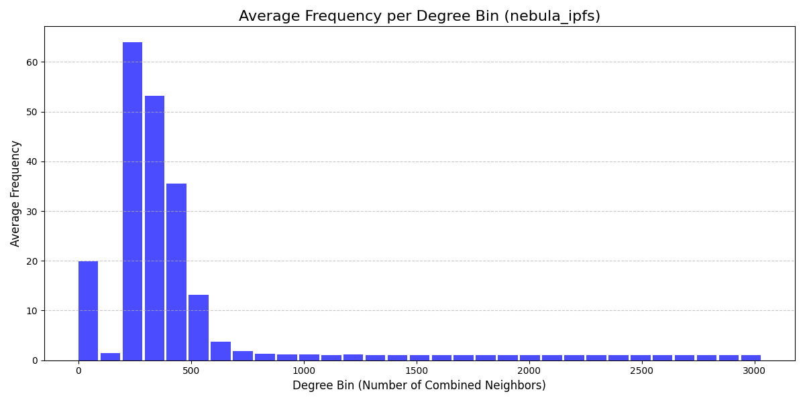
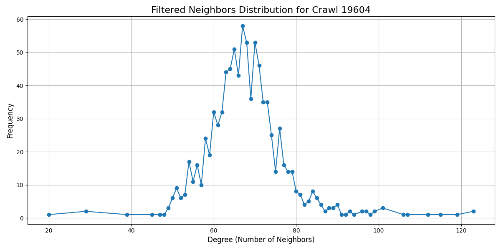

# Centralization Metrics for P2P Network Databases

This project analyzes the centralization of peer-to-peer (P2P) networks using three key metrics: **Degree Distribution**, **Latency-Based Distribution**, and **ISP Centralization**. The metrics are computed for the following databases:
- `nebula_ipfs`
- `nebula_polkadot`
- `nebula_avail_mainnet`
- `nebula_filecoin`

The analysis helps to identify potential centralization bottlenecks in P2P overlays and provides insights into the distribution of network resources.

---

## Metrics Overview

### 1. **Degree Distribution**
**Purpose**: Measures the connectivity of nodes in the P2P network.  
- Nodes with higher degrees are more central, potentially serving as hubs in the network.  
- **Steps**:
  1. Extract the neighbors of each node.
  2. Calculate the degree of each node (number of neighbors).
  3. Analyze the frequency distribution of node degrees.
  4. Calculate the **degree centrality** of the graph to assess centralization.
  
#### Degree Centrality in Undirected Graphs

Degree centrality measures how many direct connections (or edges) a node in a graph has relative to the maximum possible number of connections. Below is the step-by-step explanation for computing degree centrality in this context:


#### **Graph Setup**
Consider an undirected graph $G = (V, E)$, where:
- $V$: set of nodes (vertices).
- $E$: set of edges connecting nodes in $V$.

The total number of nodes is $N = |V|$.


#### **Degree of a Node**
The **degree** of a node $i$, denoted as $d(i)$, is the number of edges connected to it.

```math
d(i) = |\{j \in V : \{i, j\} \in E \}|
```


#### **Degree Centrality**
Degree centrality \( C_D(i) \) for a node \( i \) is the ratio of its degree \( d(i) \) to the maximum possible degree in the graph \( N - 1 \), which occurs when the node is connected to all other nodes in \( V \).

```math
C_D(i) = \frac{d(i)}{N - 1}
```


#### **Degree Centralization**
Degree centralization measures the inequality of degree centrality across all nodes in the graph. It captures how central the most connected node is relative to others.

#### Formula:
```math
C^* = \frac{\sum_{i=1}^{N} \left( C_{\text{max}} - C_D(i) \right)}{(N - 1)(C_{\text{max}} - 0)}
```

Where:
- $C_{\text{max}}$: maximum degree centrality in the graph.
- $C_D(i)$: degree centrality of node $i$.

This normalizes the centralization score to a value between 0 and 1, where:
- $C^* = 1$ indicates a star graph (one central node connected to all others).
- $C^* = 0$ indicates a completely regular graph (e.g., all nodes have the same degree).


---

### 2. **Latency-Based Distribution**
**Purpose**: Analyzes centralization based on the uptime of the nodes during dialing.  
- Nodes with low dial durations indicate connectivity issues.
- Networks with a high variance in dial durations indicate inconsistency in the reliability of the nodes.  
- **Steps**:
  1. Compute average latency (e.g.`dial_duration`) for each node.
  2. Compute the Entropy-Based Centrality of these latencies.
   
#### Entropy-Based Centrality

Entropy-Based Centrality measures the distribution of a continuous quantity (e.g., crawl durations) across nodes in a network. It uses **Shannon Entropy** to quantify whether the distribution is even or centralized.

#### Formula
Normalize the quantity $x_i$ for node $i$:
```math
p_i = \frac{x_i}{\sum_{j=1}^n x_j}
```

Compute entropy:
```math
H = -\sum_{i=1}^n p_i \cdot \log(p_i)
```

```math
H_{\text{normalized}} = \frac{H}{\log(n)}
```

#### Interpretation
- **Higher Entropy**: $H_{\text{normalized}}=1$ indicates Uniform distribution across nodes. 
- **Lower Entropy**: Centralized distribution dominated by a few nodes.
 


---

### 3. **Country Centralization**

**Purpose**: Analyzes how nodes in the network are distributed across countries

- **Steps**:  
  1. **Extract Countries**:   
  2. **Count Country Frequencies**: Compute the number of nodes associated with each country.  
  3. **Quantify Centralization**: Apply Gini Coefficient metric to measures inequality in country frequencies.
 
  


### **Steps to Compute the Gini Coefficient**

The following outlines the step-by-step process for calculating the Gini coefficient:


#### **Flatten the Array**


Ensure the input is a 1D array.

  ```math
  x = [x_1, x_2, \dots, x_n]
  ```


#### **Handle Negative Values**


Adjust the array to remove any negative values.

  ```math
  x_i = x_i - \min(x) \quad \forall \, x_i \in x
  ```


#### **Avoid Zero Values**


Add a small constant (\( \epsilon \)) to prevent division errors or issues with zeros.

 
  ```math
  x_i = x_i + \epsilon \quad \forall \, x_i \in x
  ```


#### **Sort the Array**


Sort the array in ascending order.

```math
x_1 \leq x_2 \leq \ldots \leq x_n
```


#### **Compute Index Values**


Assign indices \( i \) to each sorted element.

```math
\text{index} = [1, 2, \dots, n]
```


#### **Total Number of Elements**

Get the total number of elements \( n \).

```math
  n = \text{len}(x)
```


Compute Weighted Sum and Denominator


```math
\text{Weighted Sum} = \sum_{i=1}^{n} (2i - n - 1) \cdot x_i
```


```math
\text{Denominator} = n \cdot \sum_{i=1}^{n} x_i
```


Calculate the Gini Coefficient
```math
G = \frac{\text{Weighted Sum}}{\text{Denominator}} = \frac{\sum_{i=1}^{n} (2i - n - 1) \cdot x_i}{n \cdot \sum_{i=1}^{n} x_i}
```


---

### 4. **IP Address Centralization**

**Purpose**: Analyzes how nodes in the network are distributed across IPv4 and IPv6 address prefixes.  

- **Centralization in Address Prefixes**:  
  IP address prefixes represent logical groupings of addresses, reflecting how networks are allocated across geographical regions or organizations. Centralization in these prefixes can reveal the extent to which network traffic or resources are concentrated within a few address ranges.  

- **Steps**:  
  1. **Extract Address Prefixes**:  
      - For IPv4 addresses, extract the `/24` prefix (e.g., `192.168.1.x`). This is used to represent the network portion of the address while the last part often 
        represents the specific host in the sub-network.
      - For IPv6 addresses, extract the `/48` prefix (e.g., `2001:db8:abcd`). This represents the network prefix
            and is used to group addresses into subnets. The last part often represent the specific interface
  2. **Count Prefix Frequencies**: Compute the number of nodes associated with each prefix.  
  3. **Quantify Centralization**: Apply Gini Coefficient metric to measures inequality in prefix frequencies.   

### 5. ASN centralization

Autonomous System Numbers are a set of Internet routable IP prefixes belonging to a network or a collection of networks that are all controlled by a single entity or organization.


---


## Results

### 1. **Degree Distribution**



**Degree Centrality** : 0.753



**Degree Centrality** : 0.603



**Degree Centrality** : 0.808



**Degree Centrality** : 0.884

#### Degree Centralization

| Database             | Average Outdegree Centralization | Average Indegree Centralization | Average Combined Centralization |
|----------------------|----------------------------------|---------------------------------|---------------------------------|
| nebula_polkadot      | 0.3775987407324174               | 0.8680617773418075              | 0.7534748991665159              |
| nebula_avail_mainnet | 0.46646691255370865              | 0.8126559646808958              | 0.6032004702492765              |
| nebula_filecoin      | 0.1288622284762083               | 0.8760253163057948              | 0.8082967375742667              |
| nebula_ipfs          | 0.2733879750343379               | 0.9311056291795552              | 0.8839550069519817              |


### 2. **Latency-Based Distribution**


| **Database**             | **Normalized Entropy** |
|--------------------------|------------------------|
| nebula_filecoin          | 0.823                  |
| nebula_polkadot          | 0.842                  |
| nebula_avail_mainnet     | 0.715                  |
| nebula_ipfs              | 0.932                  |


### 3. **Country Centralization**


| **Database**             | **Gini Coefficient** | Number of Peers |
|--------------------------|----------------------|-----------------|
| nebula_ipfs              | 0.927                | 54234.8         |
| nebula_filecoin          | 0.934                | 2697.2          |
| nebula_polkadot          | 0.930                | 8582.6          |
| nebula_avail_mainnet     | 0.772                | 855.8           |


### 4. **IP-Address Centralization**


| Database                | Gini Coefficient | Number of Peers |
|-------------------------|------------------|-----------------|
| nebula_ipfs             | 0.510            | 54234.8         |
| nebula_filecoin         | 0.653            | 2697.2          |
| nebula_polkadot         | 0.722            | 8582.6          |
| nebula_avail_mainnet    | 0.387            | 855.8           |

### 5. ASN centralization

| Database                | Gini Coefficient | Number of Peers |
|-------------------------|------------------|-----------------|
| nebula_ipfs             | 0.981            | 54234.8         |
| nebula_filecoin         | 0.946            | 2697.2          |
| nebula_polkadot         | 0.986            | 8582.6          |
| nebula_avail_mainnet    | 0.819            | 855.8           |


### IPFS frequency bump

In this section we will study the IPFS networks in more detail paying special attention to the frequency bump in Figure \ref{fig:1} in the frequency range $[50,80]$.

We will start by studying the in-degree, which is the proportion of direct neighbors among all the nodes present.

The neighbor type of each node, whether direct or reversed, might give information about the function of that node.
For example, nodes without reversed neighbors likely act as clients that connect exclusively to a few other nodes acting as providers.
At each degree we will show the frequency as before, but also the out-degree ratio.

To simplify the analysis we will focus on one crawl.



