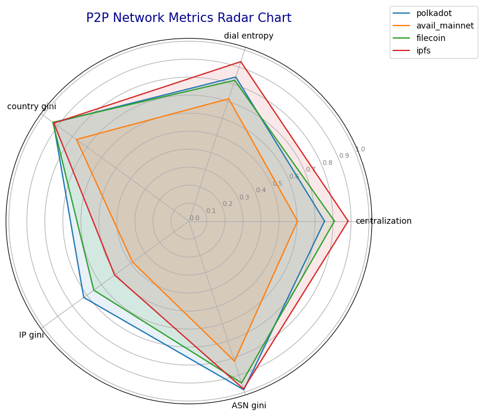

# Centralization Metrics for P2P Network Databases

This project analyzes the centralization of peer-to-peer (P2P) networks using different centralization metrics. The networks correspond to the following databases:
- `nebula_ipfs`
- `nebula_polkadot`
- `nebula_avail_mainnet`
- `nebula_filecoin`

---


## Project Directory Structure

```plaintext
Centralization-Metrics-for-P2P-Network-Databases/
├── code/
│   ├── address_prefix_gini.py        #Computes the gini coefficient of the IP Address prefixes
│   ├── asn_gini.py                   #Computes the gini coefficient of the autonomous system numbers
│   ├── country_gini.py               #Computes the gini coefficient of the country distribution
│   ├── degree_centrality.py          #Computes the in, out and combined degree centralization for each network 
│   ├── degree_plot.py                #Outputs the degree plot for each network. The database name has to be specified in the script
│   ├── dial_duration_entropy.py      #Computes the dial duration entropy
│   ├── radar_chart.py                #Outputs the radar chart for all metrics
├──images/                             # All generated images
                 
```

---

## Metrics Overview


  
#### Degree Centrality in Undirected Graphs

Degree centrality measures how many direct connections (or edges) a node in a graph has relative to the maximum possible number of connections. Below is the step-by-step explanation for computing degree centrality in this context.

Consider an undirected graph $G = (V, E)$, where:
- $V$: set of nodes (vertices).
- $E$: set of edges connecting nodes in $V$.

The total number of nodes is $N = |V|$.


#### **Degree of a Node**
The **degree** of a node $i$, denoted as $d(i)$, is the number of edges connected to it.

```math
d(i) = |\{j \in V : \{i, j\} \in E \}|
```


#### **Degree Centrality**
Degree centrality \( C_D(i) \) for a node \( i \) is the ratio of its degree \( d(i) \) to the maximum possible degree in the graph \( N - 1 \), which occurs when the node is connected to all other nodes in \( V \).

```math
C_D(i) = \frac{d(i)}{N - 1}
```


#### **Degree Centralization**
Degree centralization measures the inequality of degree centrality across all nodes in the graph. It captures how central the most connected node is relative to others.


```math
C^* = \frac{\sum_{i=1}^{N} \left( C_{\text{max}} - C_D(i) \right)}{(N - 1)(C_{\text{max}} - 0)}
```

Where:
- $C_{\text{max}}$: maximum degree centrality in the graph.
- $C_D(i)$: degree centrality of node $i$.

This normalizes the centralization score to a value between 0 and 1, where:
- $C^* = 1$ indicates a star graph (one central node connected to all others).
- $C^* = 0$ indicates a completely regular graph (e.g., all nodes have the same degree).


---

   
#### Shannon Entropy 

Shannon Entropy measures the distribution of a continuous quantity (e.g., crawl durations) across nodes in a network and determines if it is even or centralized.


```math
H = -\sum_{i=1}^n p_i \cdot \log(p_i)
```

```math
H_{\text{normalized}} = \frac{H}{\log(n)}
```

where 

```math
p_i = \frac{x_i}{\sum_{j=1}^n x_j}
```

#### Interpretation
- **Higher Entropy**: $H_{\text{normalized}}=1$ indicates Uniform distribution across nodes. 
- **Lower Entropy**: Centralized distribution dominated by a few nodes.
 


---

**Gini Coefficient**

The Gini coefficient measures the inequality among the values of a frequency distribution. It is computed based on the Weighted Sum and Denominator:


```math
G = \frac{\text{Weighted Sum}}{\text{Denominator}} = \frac{\sum_{i=1}^{n} (2i - n - 1) \cdot x_i}{n \cdot \sum_{i=1}^{n} x_i}
```

where \( n \) is the total number of elements.


---


## Results

### 1. **Degree Distribution**


#### Degree Centralization

| Database             | Average Outdegree Centralization | Average Indegree Centralization | Average Combined Centralization |
|----------------------|----------------------------------|---------------------------------|---------------------------------|
| nebula_polkadot      | 0.378                            | 0.868                           | 0.753                           |
| nebula_avail_mainnet | 0.466                            | 0.813                           | 0.603                           |
| nebula_filecoin      | 0.129                            | 0.876                           | 0.808                           |
| nebula_ipfs          | 0.273                            | 0.931                           | 0.884                           |


The table displays the degree centralization rate for the Outdegree, Indegree and the combination of both. We realize that the Outdegree exhibits lower centralization scores reflecting a more decentralized structure, while the Indegree's centralization scores are much higher, hence the total network has a more centralized structure.  

### 2. **Latency-Based Distribution**


| **Database**             | **Normalized Entropy** | **Number of Peers** |
|--------------------------|------------------------|---------------------|
| nebula_filecoin          | 0.823                  |     54234.8         |
| nebula_polkadot          | 0.842                  |     2697.2          |
| nebula_avail_mainnet     | 0.715                  |     8582.6          |
| nebula_ipfs              | 0.932                  |     855.8           |


### 3. **Country Centralization**


| **Database**             | **Gini Coefficient** | Number of Peers |
|--------------------------|----------------------|-----------------|
| nebula_ipfs              | 0.927                | 54234.8         |
| nebula_filecoin          | 0.934                | 2697.2          |
| nebula_polkadot          | 0.930                | 8582.6          |
| nebula_avail_mainnet     | 0.772                | 855.8           |


### 4. **IP-Address Centralization**


| Database                | Gini Coefficient | Number of Peers |
|-------------------------|------------------|-----------------|
| nebula_ipfs             | 0.510            | 54234.8         |
| nebula_filecoin         | 0.653            | 2697.2          |
| nebula_polkadot         | 0.722            | 8582.6          |
| nebula_avail_mainnet    | 0.387            | 855.8           |

### 5. ASN centralization

| Database                | Gini Coefficient | Number of Peers |
|-------------------------|------------------|-----------------|
| nebula_ipfs             | 0.981            | 54234.8         |
| nebula_filecoin         | 0.946            | 2697.2          |
| nebula_polkadot         | 0.986            | 8582.6          |
| nebula_avail_mainnet    | 0.819            | 855.8           |


### 6. Radar Chart




